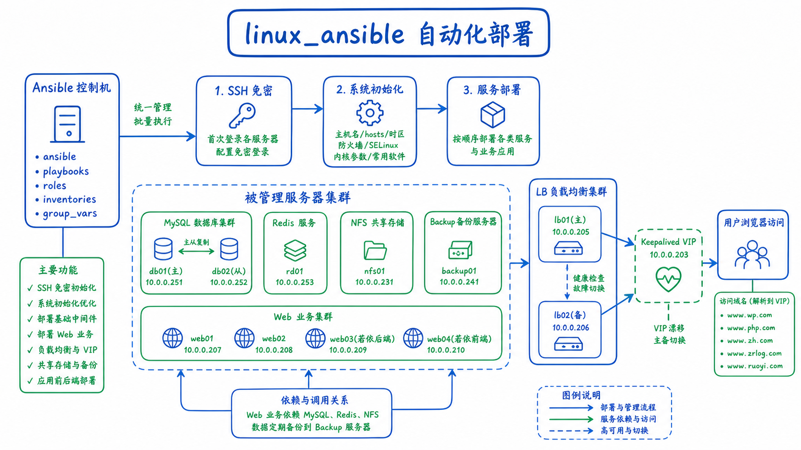
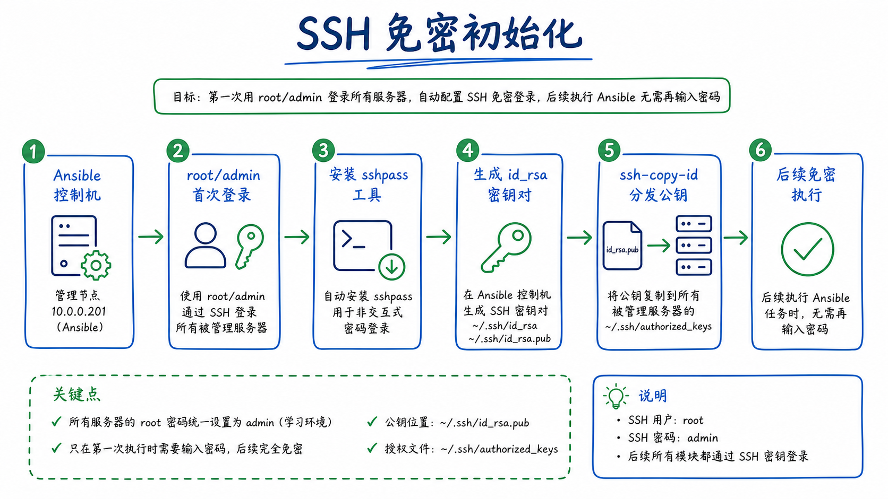
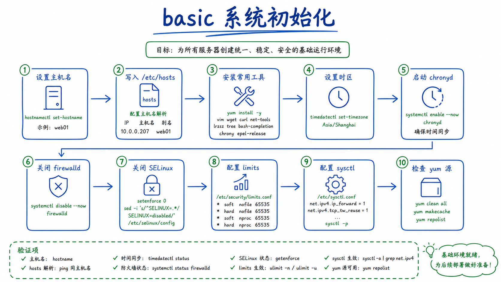
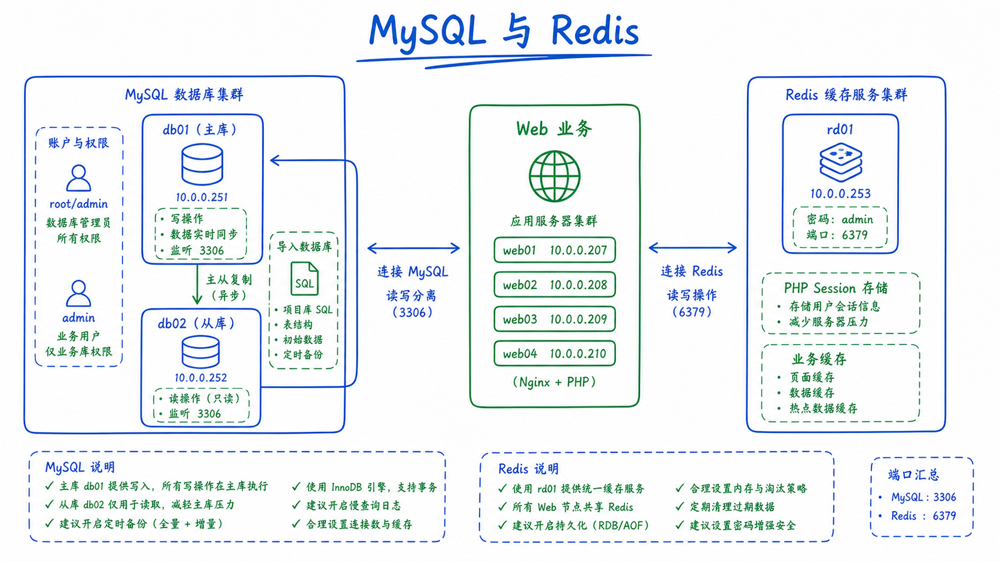
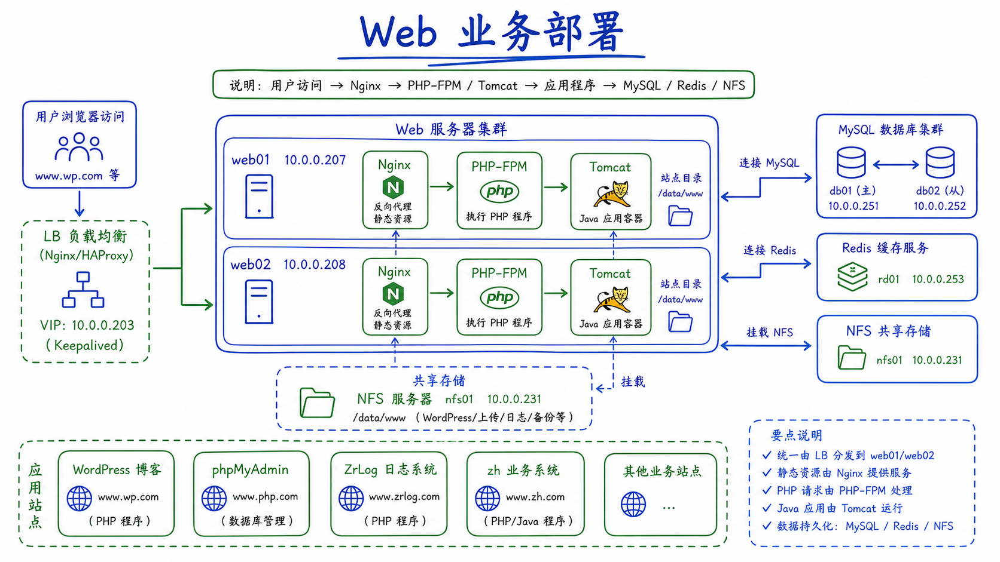
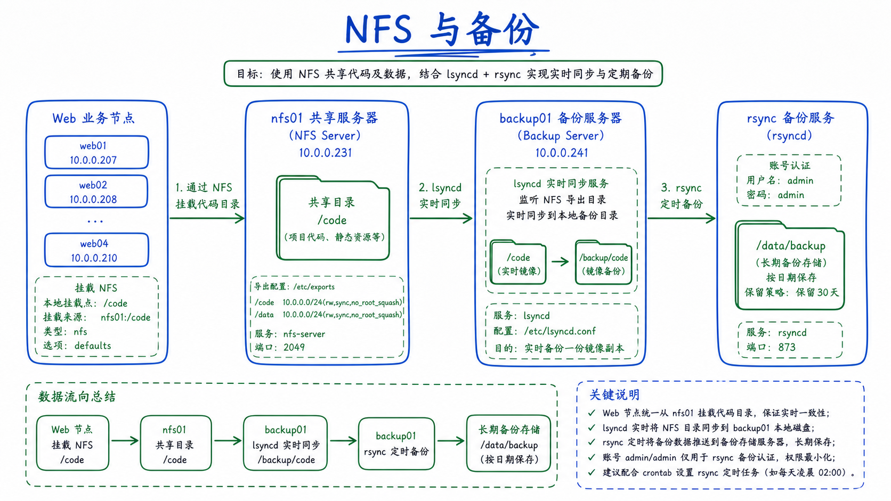
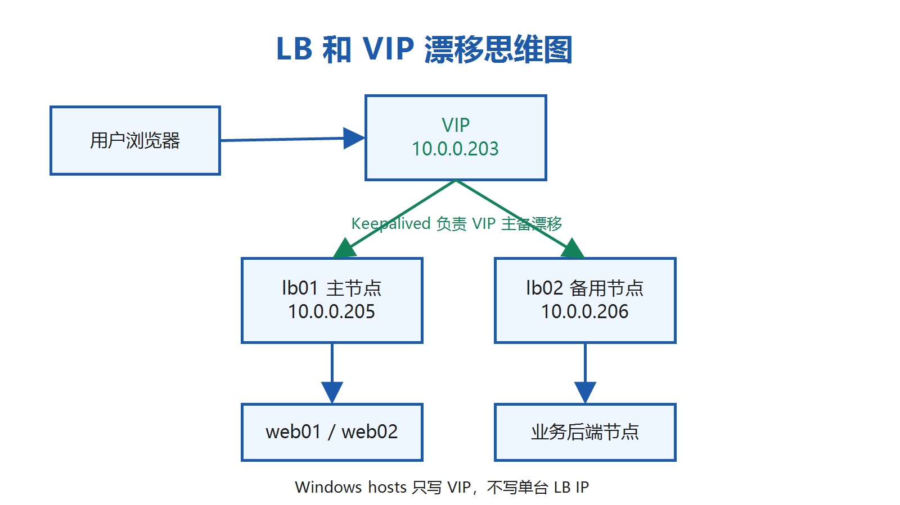
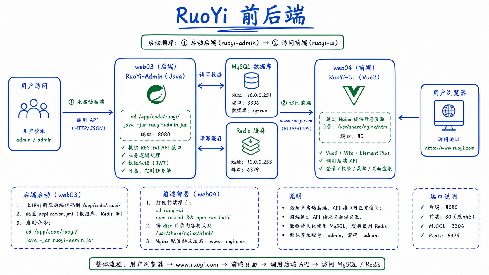

# linux_ansible 自动化部署项目

这是一个用于学习 Linux 企业级自动化部署的 Ansible 项目。你可以把它理解成“一键部署一整套网站业务环境”的脚本集合：先准备 SSH 免密，再初始化系统，然后部署 MySQL、Redis、Nginx、PHP、NFS、备份、负载均衡、WordPress、phpMyAdmin、ZrLog 和 RuoYi。

## 一、必须使用的系统版本

本项目按下面这个系统环境编写和验证：

```text
系统名称: Kylin Linux Advanced Server V10 (Lance)
系统 ID: kylin
系统版本: V10
内核版本: 4.19.90-52.22.v2207.ky10.x86_64
Ansible 版本: ansible core 2.13.13
安装镜像: Kylin-Server-V10-SP3-General-Release-2303-X86_64.iso
```

请尽量使用同版本 Kylin 系统。因为本项目里有固定版本 RPM 包、Kylin 服务名、yum 包名和网卡配置方式，如果换成其他系统，可能会出现包安装失败、服务名不一致、网卡配置不生效等问题。

系统 ISO 不包含在本仓库和 Release 中。请通过麒麟软件官方渠道或你所在组织的正版镜像库获取上述同名镜像，不要随意换成 CentOS、Rocky Linux、Ubuntu 或其他 Kylin 版本。

拿到镜像后可校验 SHA256。本项目验证时使用的 ISO 校验值为：

```text
7E89F3C7DD9454F458A48969A1689EE4002335E839F67A999ACD28D4007E11E7
```

## 二、项目整体思维图



## 三、服务器规划

| 主机名 | 管理网 IP | 内网 IP | 作用 |
| --- | --- | --- | --- |
| jump | 10.0.0.200 | 172.16.1.200 | 跳板机 |
| ansible | 10.0.0.201 | - | Ansible 控制机 |
| lb01 | 10.0.0.205 | 172.16.1.205 | 主负载均衡 |
| lb02 | 10.0.0.206 | 172.16.1.206 | 备用负载均衡 |
| VIP | 10.0.0.203 | - | 所有业务浏览器访问入口 |
| web01 | 10.0.0.207 | 172.16.1.207 | Web 业务节点 |
| web02 | 10.0.0.208 | 172.16.1.208 | Web 业务节点 |
| web03 | 10.0.0.209 | 172.16.1.209 | RuoYi 后端 |
| web04 | 10.0.0.210 | 172.16.1.210 | RuoYi 前端 |
| nfs01 | 10.0.0.231 | 172.16.1.231 | NFS 共享存储 |
| backup01 | 10.0.0.241 | 172.16.1.241 | rsync 备份服务器 |
| db01 | 10.0.0.251 | 172.16.1.251 | MySQL 主库 |
| db02 | 10.0.0.252 | 172.16.1.252 | MySQL 从库 |
| rd01 | 10.0.0.253 | 172.16.1.253 | Redis |

`10.0.0.205` 和 `10.0.0.206` 只是负载均衡节点 IP，用户浏览器不要直接解析到它们。所有业务域名统一解析到 VIP：`10.0.0.203`。VIP 会在 `lb01` 和 `lb02` 之间漂移，主节点故障时，备用节点会接管。

## 四、这个项目实现了什么

| 模块 | 作用 |
| --- | --- |
| ssh | 第一次用 root/admin 登录所有服务器，然后自动配置 SSH 免密 |
| basic | 设置主机名、hosts、常用工具、时区、chrony、防火墙、SELinux、limits、sysctl |
| nginx | 安装并配置 Nginx |
| php | 安装 PHP-FPM，并配置 Redis Session |
| mysql | 安装 MariaDB/MySQL、设置 root/admin 密码、创建业务用户、导入数据库 |
| redis | 安装 Redis，并把密码设置为 admin |
| nfs | 部署 NFS 共享目录，并配合 lsyncd 同步 |
| backup | 部署 rsync 备份服务 |
| lb | 部署 Nginx 负载均衡和 Keepalived VIP 漂移 |
| web | 部署 WordPress、phpMyAdmin、ZrLog |
| tomcat | 部署 Tomcat，为 Java 业务提供运行环境 |
| ruoyi-back | 部署 RuoYi 后端 |
| ruoyi-front | 部署 RuoYi 前端 |

## 五、每个小功能思维图















## 六、目录结构为什么这样设计

```text
/ansible
├── ansible.cfg
├── inventories
│   └── production
│       ├── hosts.ini
│       └── group_vars
├── playbooks
│   ├── site.yml
│   └── test.yml
└── roles
    ├── ssh
    ├── basic
    ├── nginx
    ├── php
    ├── mysql
    ├── redis
    ├── nfs
    ├── backup
    ├── lb
    ├── web
    ├── tomcat
    ├── ruoyi-back
    └── ruoyi-front
```

- `ansible.cfg`：Ansible 主配置文件，指定主机清单路径、roles 路径、Python 解释器等。
- `inventories/production/hosts.ini`：主机清单。以后换服务器，优先改这里的 IP。
- `inventories/production/group_vars/`：组变量目录。密码、VIP、网段、业务变量统一放这里。
- `playbooks/site.yml`：总入口，负责按顺序调用所有角色。
- `playbooks/test.yml`：单独测试入口，适合只验证某个模块。
- `roles/`：每个服务一个角色，方便复用、排错和单独维护。

这种结构接近企业里的 Ansible 项目结构：主机归主机、变量归变量、入口归入口、服务归角色。后续新增服务时，只需要新增 role，再在 playbook 里调用。

## 七、必须知道的路径和命令

```bash
#主机清单
vim /ansible/inventories/production/hosts.ini

# site路径(调用其他所有yml文件)
vim /ansible/playbooks/site.yml
vim /ansible/playbooks/test.yml

# 系统优化
vim /ansible/roles/basic/tasks/main.yml

#Ansible 的主配置文件
vim /ansible/ansible.cfg

#组变量路径
cd /ansible/inventories/production/group_vars

#执行所有脚本
cd /ansible
ansible-playbook playbooks/site.yml

#执行单个脚本
cd /ansible
ansible-playbook playbooks/test.yml

#ssh配置
vim /ansible/roles/ssh/tasks/main.yml
```

## 八、如何部署这个 Ansible 项目

1. 准备同版本 Kylin 服务器。
2. 按服务器规划设置 IP。
3. 所有被管理服务器的 root 密码设置为 `admin`。
4. 把项目放到 Ansible 控制机：

```bash
cd /
tar xf linux_ansible_full.tar.gz
mv linux_ansible /ansible
```

5. 修改主机清单：

```bash
vim /ansible/inventories/production/hosts.ini
```

6. 如果你改了网段或 VIP，修改组变量：

```bash
cd /ansible/inventories/production/group_vars
vim all.yml
vim lb.yml
```

7. 执行完整部署：

```bash
cd /ansible
ansible-playbook playbooks/site.yml
```

第一次执行时，`ssh` 角色会先使用 `root/admin` 登录各服务器并配置免密。后续再执行，就会使用 SSH key。

## 九、账号和密码

学习版统一账号和密码，方便新手理解和测试：

```text
服务器 SSH 用户: root
服务器 SSH 密码: admin
MySQL root 密码: admin
业务数据库用户: admin
业务数据库密码: admin
Redis 密码: admin
Keepalived 认证密码: admin
rsync 用户: admin
rsync 密码: admin
Web 业务登录用户: admin
Web 业务登录密码: admin
```

真实生产环境不要这样设置，应该使用 Ansible Vault 或其他密钥管理工具。

## 十、阿里云证书秘钥说明

生产环境 HTTPS 证书通常由阿里云申请，然后把证书和私钥放入：

```text
roles/lb/files/server.pem
roles/lb/files/server.key
```

本公开仓库不会上传真实秘钥，所以这里隐藏了。如果你没有放阿里云证书，本项目会自动生成学习用自签名证书，保证 Ansible 部署不会因为缺少证书而失败。

## 十一、Windows hosts 解析

在你的 Windows 电脑上，用管理员权限打开记事本，编辑：

```text
C:\Windows\System32\drivers\etc\hosts
```

添加：

```text
10.0.0.203 www.wp.com
10.0.0.203 www.php.com
10.0.0.203 www.zh.com
10.0.0.203 www.zrlog.com
10.0.0.203 www.ruoyi.com
```

所有业务都解析到 VIP `10.0.0.203`，不要解析到 `10.0.0.205` 或 `10.0.0.206`。

## 十二、业务访问和登录

### WordPress

```text
hosts 解析: 10.0.0.203 www.wp.com
访问地址: http://www.wp.com
后台地址: http://www.wp.com/wp-admin
用户名: admin
密码: admin
```

### phpMyAdmin

```text
hosts 解析: 10.0.0.203 www.php.com
访问地址: http://www.php.com
用户名: admin
密码: admin
```

### ZrLog

```text
hosts 解析: 10.0.0.203 www.zrlog.com
访问地址: http://www.zrlog.com
用户名: admin
密码: admin
```

### zh 业务

```text
hosts 解析: 10.0.0.203 www.zh.com
访问地址: http://www.zh.com
说明: 普通 Web 页面，通常不需要后台登录
```

### RuoYi

若依必须先启动后端。先登录 `web03` 后端服务器：

```bash
ssh root@10.0.0.209
cd /app/code/ruoyi/
java -jar ruoyi-admin.jar
```

后端启动后，再访问：

```text
hosts 解析: 10.0.0.203 www.ruoyi.com
访问地址: http://www.ruoyi.com
用户名: admin
密码: admin
```

如果没有先启动后端，前端页面可能能打开，但登录或接口请求会失败。

## 十三、常见问题

### 1. 第一次运行为什么要先做 SSH？

因为 Ansible 需要通过 SSH 控制其他服务器。第一次还没有免密，所以项目会用 `root/admin` 登录，然后自动复制公钥。以后再运行就不需要重复输入密码。

### 2. 为什么浏览器 hosts 要写 10.0.0.203？

`10.0.0.203` 是 Keepalived VIP，是统一入口。`10.0.0.205` 和 `10.0.0.206` 是具体 LB 节点，直接写节点 IP 会失去 VIP 漂移的意义。

### 3. 为什么必须同版本 Kylin？

因为软件包、服务名和系统配置方式跟系统版本有关。换系统后，`mariadb`、`network-scripts`、RPM 包依赖等可能不一样。

### 4. 若依为什么登录失败？

先确认 `web03` 后端是否启动：

```bash
cd /app/code/ruoyi/
java -jar ruoyi-admin.jar
```

再访问 `http://www.ruoyi.com`。

### 5. GitHub 仓库里为什么没有真实 server.key？

`server.key` 是证书私钥，不能公开。真实环境请使用阿里云证书；学习环境会自动生成自签名证书。

## 十四、下载说明

GitHub 仓库保存代码、文档和小文件。JDK、应用包等大文件会放到 GitHub Release。

如果只是学习代码结构，可以直接 clone 仓库。如果要完整部署，请直接下载 Release 中的完整包：

```text
linux_ansible_full.zip
```

完整包 SHA256：

```text
63EAE2C5143811F85AFECF875A1B422D18E548A9564CEB08F9588FB1ED38CF79
```

下载后解压完整包，把里面的项目放到 Ansible 控制机 `/ansible` 即可使用。
